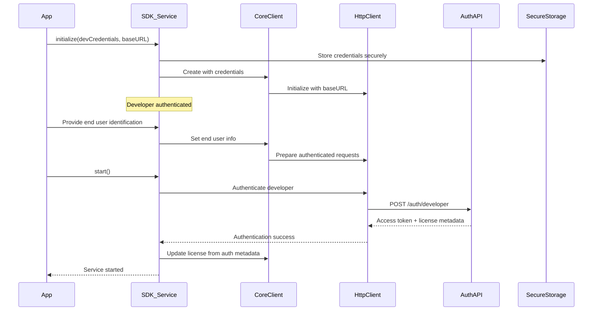
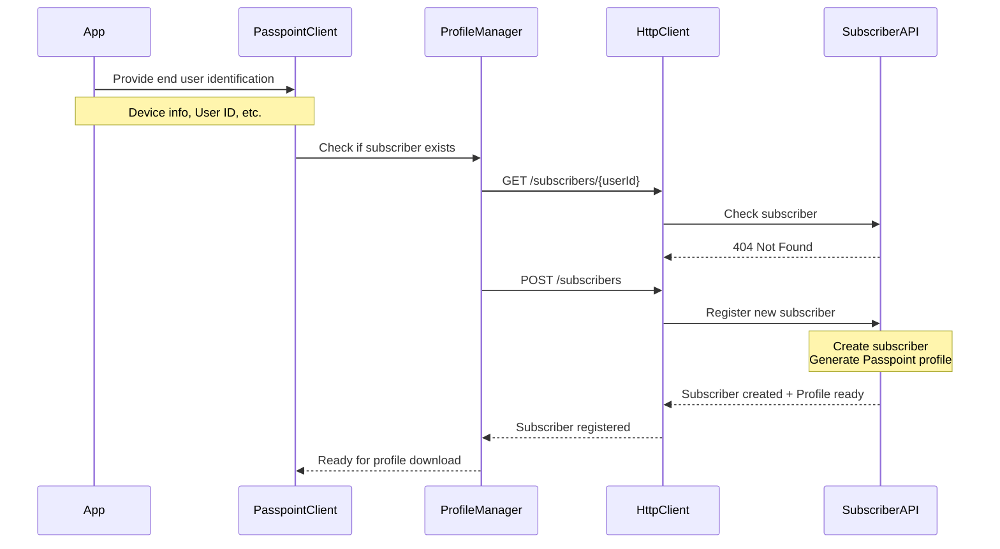

# Authentication & Initialization Flow

## Developer Authentication Flow

```mermaid
sequenceDiagram
    participant App
    participant SDK_Service
    participant CoreClient
    participant HttpClient
    participant AuthAPI
    participant SecureStorage
    
    App->>SDK_Service: initialize(devCredentials, baseURL)
    SDK_Service->>SecureStorage: Store credentials securely
    SDK_Service->>CoreClient: Create with credentials
    CoreClient->>HttpClient: Initialize with baseURL
    
    Note over SDK_Service: Developer authenticated
    
    App->>SDK_Service: Provide end user identification
    SDK_Service->>CoreClient: Set end user info
    CoreClient->>HttpClient: Prepare authenticated requests
    
    App->>SDK_Service: start()
    SDK_Service->>HttpClient: Authenticate developer
    HttpClient->>AuthAPI: POST /auth/developer
    AuthAPI-->>HttpClient: Access token + license metadata
    HttpClient-->>SDK_Service: Authentication success
    SDK_Service->>CoreClient: Update license from auth metadata
    SDK_Service-->>App: Service started
```

## Subscriber Registration Flow

```mermaid
sequenceDiagram
    participant App
    participant PasspointClient
    participant ProfileManager
    participant HttpClient
    participant SubscriberAPI
    
    App->>PasspointClient: Provide end user identification
    Note over App,PasspointClient: Device info, User ID, etc.
    
    PasspointClient->>ProfileManager: Check if subscriber exists
    ProfileManager->>HttpClient: GET /subscribers/{userId}
    HttpClient->>SubscriberAPI: Check subscriber
    SubscriberAPI-->>HttpClient: 404 Not Found
    
    ProfileManager->>HttpClient: POST /subscribers
    HttpClient->>SubscriberAPI: Register new subscriber
    Note over SubscriberAPI: Create subscriber<br/>Generate Passpoint profile
    SubscriberAPI-->>HttpClient: Subscriber created + Profile ready
    HttpClient-->>ProfileManager: Subscriber registered
    ProfileManager-->>PasspointClient: Ready for profile download
```

