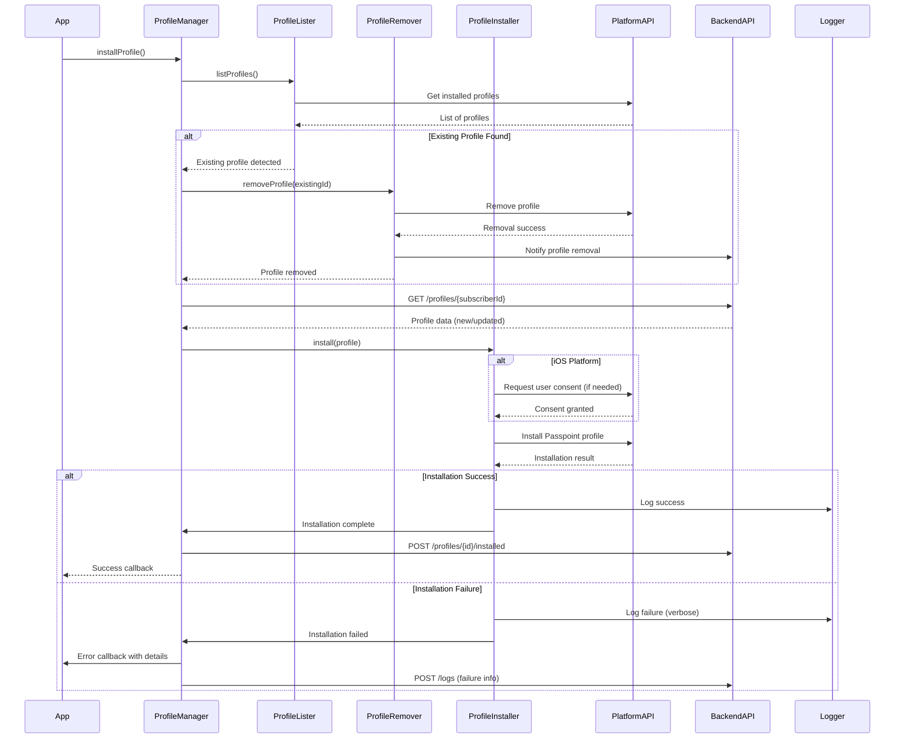
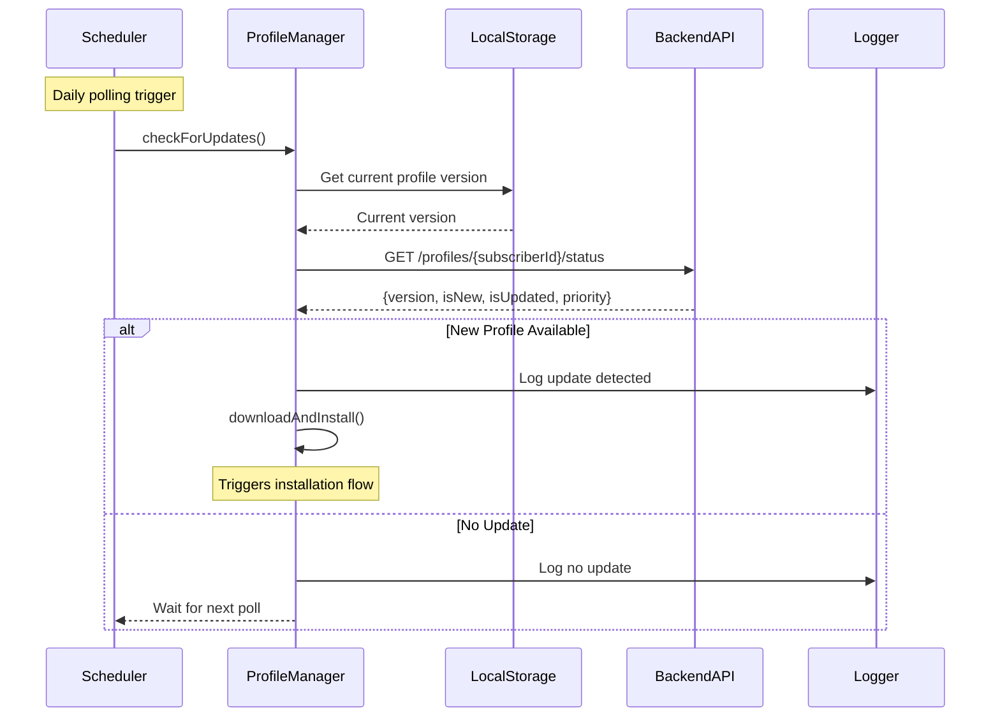
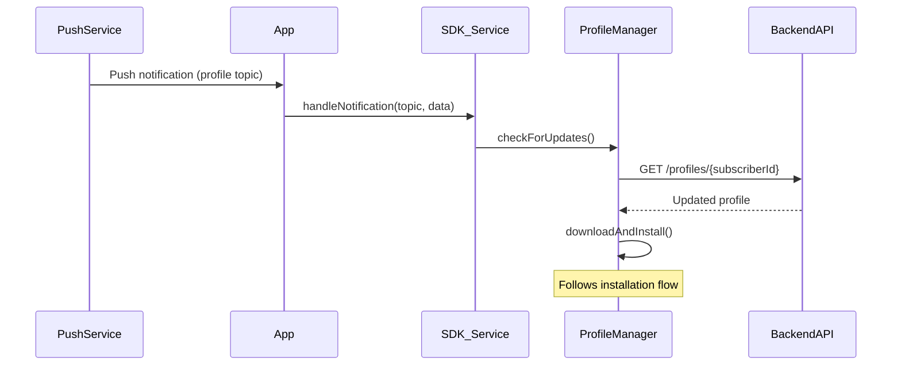

# Profile Installation & Management Flow

## Single Profile Installation Flow

```mermaid
sequenceDiagram
    participant App
    participant ProfileManager
    participant ProfileLister
    participant ProfileRemover
    participant ProfileInstaller
    participant PlatformAPI
    participant BackendAPI
    participant Logger
    
    App->>ProfileManager: installProfile()
    
    ProfileManager->>ProfileLister: listProfiles()
    ProfileLister->>PlatformAPI: Get installed profiles
    PlatformAPI-->>ProfileLister: List of profiles
    
    alt Existing Profile Found
        ProfileLister-->>ProfileManager: Existing profile detected
        ProfileManager->>ProfileRemover: removeProfile(existingId)
        ProfileRemover->>PlatformAPI: Remove profile
        PlatformAPI-->>ProfileRemover: Removal success
        ProfileRemover->>BackendAPI: Notify profile removal
        ProfileRemover-->>ProfileManager: Profile removed
    end
    
    ProfileManager->>BackendAPI: GET /profiles/{subscriberId}
    BackendAPI-->>ProfileManager: Profile data (new/updated)
    
    ProfileManager->>ProfileInstaller: install(profile)
    
    alt iOS Platform
        ProfileInstaller->>PlatformAPI: Request user consent (if needed)
        PlatformAPI-->>ProfileInstaller: Consent granted
    end
    
    ProfileInstaller->>PlatformAPI: Install Passpoint profile
    PlatformAPI-->>ProfileInstaller: Installation result
    
    alt Installation Success
        ProfileInstaller->>Logger: Log success
        ProfileInstaller->>ProfileManager: Installation complete
        ProfileManager->>BackendAPI: POST /profiles/{id}/installed
        ProfileManager-->>App: Success callback
    else Installation Failure
        ProfileInstaller->>Logger: Log failure (verbose)
        ProfileInstaller->>ProfileManager: Installation failed
        ProfileManager->>App: Error callback with details
        ProfileManager->>BackendAPI: POST /logs (failure info)
    end
```

## Profile Update Detection Flow

```mermaid
sequenceDiagram
    participant Scheduler
    participant ProfileManager
    participant LocalStorage
    participant BackendAPI
    participant Logger
    
    Note over Scheduler: Daily polling trigger
    
    Scheduler->>ProfileManager: checkForUpdates()
    ProfileManager->>LocalStorage: Get current profile version
    LocalStorage-->>ProfileManager: Current version
    
    ProfileManager->>BackendAPI: GET /profiles/{subscriberId}/status
    BackendAPI-->>ProfileManager: {version, isNew, isUpdated, priority}
    
    alt New Profile Available
        ProfileManager->>Logger: Log update detected
        ProfileManager->>ProfileManager: downloadAndInstall()
        Note over ProfileManager: Triggers installation flow
    else No Update
        ProfileManager->>Logger: Log no update
        ProfileManager-->>Scheduler: Wait for next poll
    end
```

## Push Notification Trigger Flow

```mermaid
sequenceDiagram
    participant PushService
    participant App
    participant SDK_Service
    participant ProfileManager
    participant BackendAPI
    
    PushService->>App: Push notification (profile topic)
    App->>SDK_Service: handleNotification(topic, data)
    SDK_Service->>ProfileManager: checkForUpdates()
    
    ProfileManager->>BackendAPI: GET /profiles/{subscriberId}
    BackendAPI-->>ProfileManager: Updated profile
    
    ProfileManager->>ProfileManager: downloadAndInstall()
    Note over ProfileManager: Follows installation flow
```

