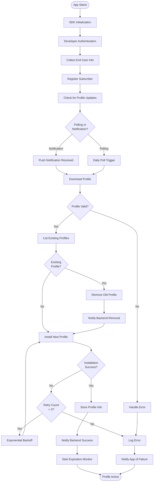
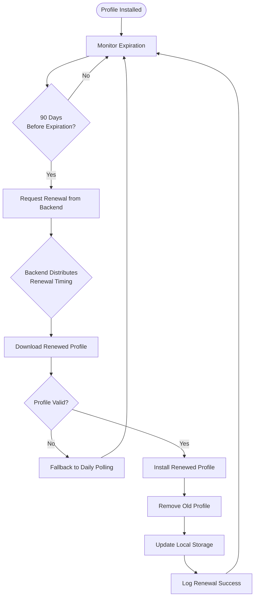
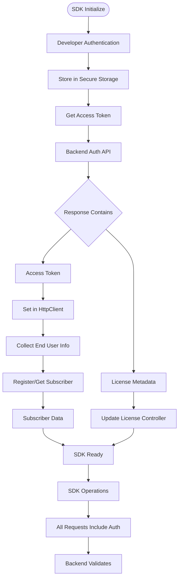

# Data Flow Diagrams

## Complete Data Flow - Profile Installation

```mermaid
flowchart TD
    Start([App Starts]) --> Init[SDK Initialization]
    Init --> Auth[Developer Authentication]
    Auth --> UserInfo[Collect End User Info]
    UserInfo --> Register[Register Subscriber]
    Register --> Check[Check for Profile Updates]
    
    Check --> Poll{Polling or<br/>Notification?}
    Poll -->|Notification| Notif[Push Notification Received]
    Poll -->|Polling| Daily[Daily Poll Trigger]
    
    Notif --> Download
    Daily --> Download[Download Profile]
    
    Download --> Validate{Profile Valid?}
    Validate -->|No| Error[Handle Error]
    Validate -->|Yes| List[List Existing Profiles]
    
    List --> Remove{Existing<br/>Profile?}
    Remove -->|Yes| RemoveOld[Remove Old Profile]
    Remove -->|No| Install
    RemoveOld --> NotifyBackend1[Notify Backend Removal]
    NotifyBackend1 --> Install[Install New Profile]
    
    Install --> Success{Installation<br/>Success?}
    Success -->|No| Retry{Retry Count<br/>< 3?}
    Retry -->|Yes| Wait[Exponential Backoff]
    Wait --> Install
    Retry -->|No| LogError[Log Error]
    LogError --> NotifyApp[Notify App of Failure]
    
    Success -->|Yes| Store[Store Profile Info]
    Store --> NotifyBackend2[Notify Backend Success]
    NotifyBackend2 --> Monitor[Start Expiration Monitor]
    Monitor --> End([Profile Active])
    
    Error --> LogError
    NotifyApp --> End
```

## Profile Renewal Data Flow

```mermaid
flowchart TD
    Start([Profile Installed]) --> Monitor[Monitor Expiration]
    Monitor --> Check{90 Days<br/>Before Expiration?}
    Check -->|No| Monitor
    Check -->|Yes| Request[Request Renewal from Backend]
    
    Request --> Distribute{Backend Distributes<br/>Renewal Timing}
    Distribute --> Download[Download Renewed Profile]
    
    Download --> Validate{Profile Valid?}
    Validate -->|No| Fallback[Fallback to Daily Polling]
    Validate -->|Yes| Install[Install Renewed Profile]
    
    Install --> Remove[Remove Old Profile]
    Remove --> Update[Update Local Storage]
    Update --> Log[Log Renewal Success]
    Log --> Monitor
    
    Fallback --> Monitor
```

## Logging Data Flow

```mermaid
flowchart LR
    A[SDK Operation] --> B{Operation Result}
    B -->|Success| C[Log Info]
    B -->|Failure| D[Log Error - Verbose]
    
    C --> E[Add Context]
    D --> E
    
    E --> F[Enqueue to Log Queue]
    F --> G{Device Online?}
    
    G -->|No| H[Store Locally]
    G -->|Yes| I[Batch Logs]
    
    H --> J[Wait for Online]
    J --> I
    
    I --> K[Compress Batch]
    K --> L[Upload to Backend]
    L --> M{Upload Success?}
    
    M -->|Yes| N[Clear Queue]
    M -->|No| H
    
    N --> O[Backend Processes Logs]
    O --> P[Map to Organization/Subscriber]
```

## Authentication & Authorization Data Flow

```mermaid
flowchart TD
    Start([SDK Initialize]) --> DevAuth[Developer Authentication]
    DevAuth --> SecureStore[Store in Secure Storage]
    SecureStore --> Token[Get Access Token]
    
    Token --> AuthAPI[Backend Auth API]
    AuthAPI --> Response{Response Contains}
    Response --> AccessToken[Access Token]
    Response --> LicenseMeta[License Metadata]
    
    AccessToken --> SetToken[Set in HttpClient]
    LicenseMeta --> UpdateLicense[Update License Controller]
    
    SetToken --> UserInfo[Collect End User Info]
    UserInfo --> SubscriberAPI[Register/Get Subscriber]
    SubscriberAPI --> SubscriberData[Subscriber Data]
    
    SubscriberData --> Ready[SDK Ready]
    UpdateLicense --> Ready
    
    Ready --> Operations[SDK Operations]
    Operations --> AuthHeader[All Requests Include Auth]
    AuthHeader --> Backend[Backend Validates]
```

