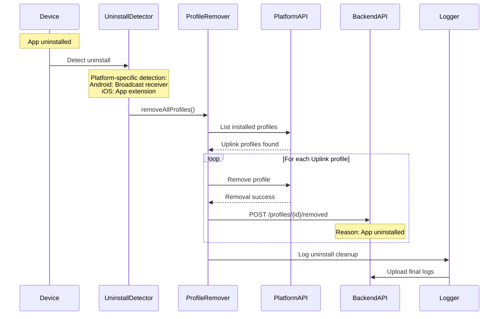
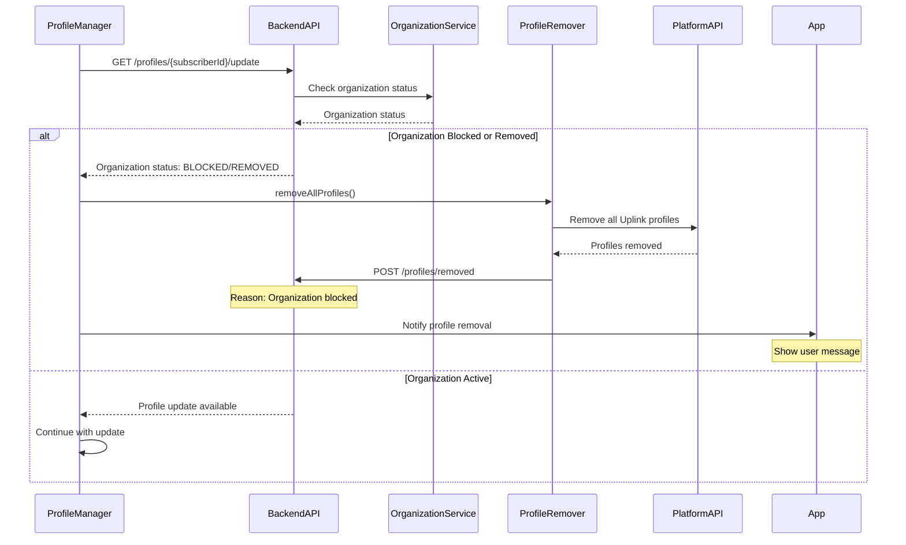
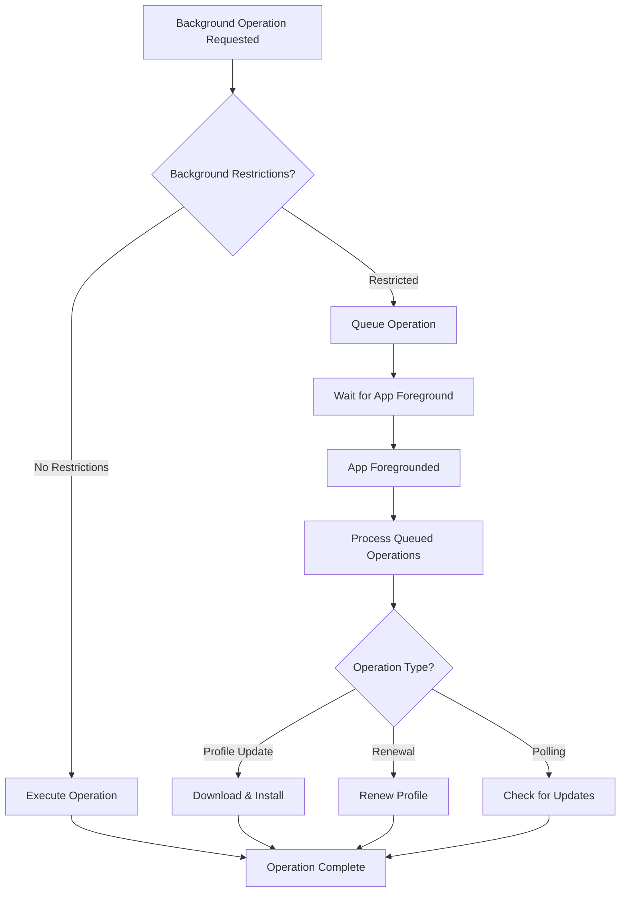
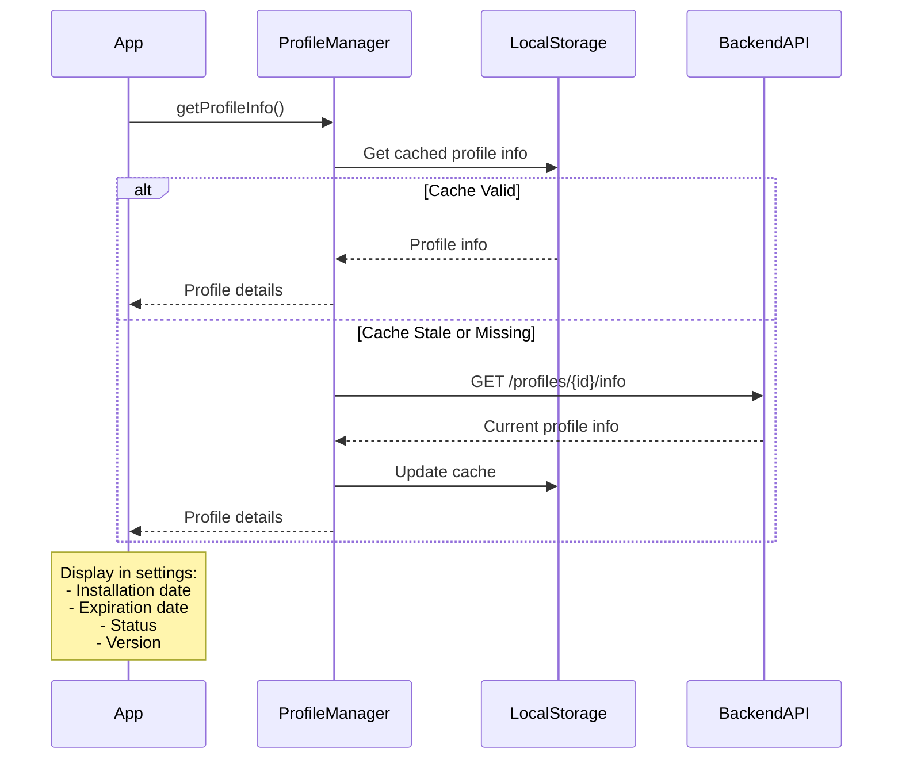

# App Lifecycle & Organization Management Flow

## App Uninstall Detection & Profile Removal

## Organization Status Monitoring Flow

## Background Operation Handling

## Profile Information Display Flow

