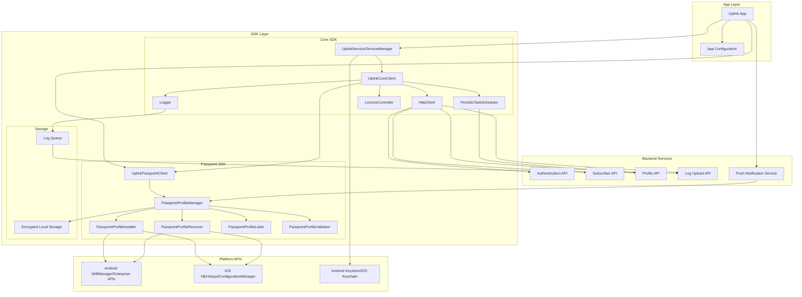
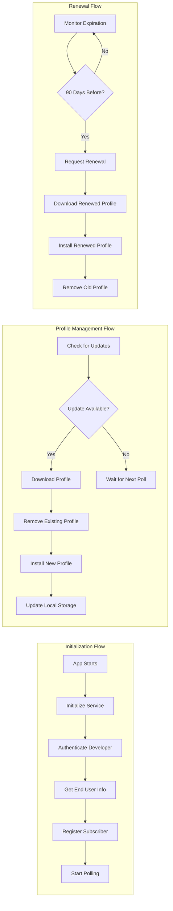

# Passpoint SDK Architecture Diagrams

## System Architecture Overview

```mermaid
graph TB
    subgraph "App Layer"
        APP[Uplink App]
        APP_CONFIG[App Configuration]
    end
    
    subgraph "SDK Layer"
        subgraph "Core SDK"
            SERVICE[UplinkService/ServiceManager]
            CORE_CLIENT[UplinkCoreClient]
            HTTP_CLIENT[HttpClient]
            LOGGER[Logger]
            SCHEDULER[PeriodicTaskScheduler]
            LICENSE[LicenseController]
        end
        
        subgraph "Passpoint SDK"
            PASS_CLIENT[UplinkPasspointClient]
            PROFILE_MGR[PasspointProfileManager]
            INSTALLER[PasspointProfileInstaller]
            REMOVER[PasspointProfileRemover]
            LISTER[PasspointProfileLister]
            VALIDATOR[PasspointProfileValidator]
        end
        
        subgraph "Storage"
            ENCRYPTED_STORE[Encrypted Local Storage]
            LOG_QUEUE[Log Queue]
        end
    end
    
    subgraph "Platform APIs"
        ANDROID_API[Android WifiManager/Enterprise APIs]
        IOS_API[iOS NEHotspotConfigurationManager]
        KEYSTORE[Android Keystore/iOS Keychain]
    end
    
    subgraph "Backend Services"
        AUTH_API[Authentication API]
        SUBSCRIBER_API[Subscriber API]
        PROFILE_API[Profile API]
        LOG_API[Log Upload API]
        NOTIFICATION_SERVICE[Push Notification Service]
    end
    
    APP --> SERVICE
    APP --> APP_CONFIG
    SERVICE --> CORE_CLIENT
    CORE_CLIENT --> HTTP_CLIENT
    CORE_CLIENT --> LOGGER
    CORE_CLIENT --> SCHEDULER
    CORE_CLIENT --> LICENSE
    
    APP --> PASS_CLIENT
    PASS_CLIENT --> PROFILE_MGR
    PROFILE_MGR --> INSTALLER
    PROFILE_MGR --> REMOVER
    PROFILE_MGR --> LISTER
    PROFILE_MGR --> VALIDATOR
    
    CORE_CLIENT --> PASS_CLIENT
    HTTP_CLIENT --> AUTH_API
    HTTP_CLIENT --> SUBSCRIBER_API
    HTTP_CLIENT --> PROFILE_API
    HTTP_CLIENT --> LOG_API
    
    INSTALLER --> ANDROID_API
    INSTALLER --> IOS_API
    REMOVER --> ANDROID_API
    REMOVER --> IOS_API
    
    SERVICE --> KEYSTORE
    LOGGER --> LOG_QUEUE
    LOG_QUEUE --> LOG_API
    SCHEDULER --> PROFILE_API
    
    APP --> NOTIFICATION_SERVICE
    NOTIFICATION_SERVICE --> PROFILE_MGR
    
    PROFILE_MGR --> ENCRYPTED_STORE
```

## Component Interaction Diagram

```mermaid
graph LR
    subgraph "Initialization Flow"
        A[App Starts] --> B[Initialize Service]
        B --> C[Authenticate Developer]
        C --> D[Get End User Info]
        D --> E[Register Subscriber]
        E --> F[Start Polling]
    end
    
    subgraph "Profile Management Flow"
        G[Check for Updates] --> H{Update Available?}
        H -->|Yes| I[Download Profile]
        H -->|No| J[Wait for Next Poll]
        I --> K[Remove Existing Profile]
        K --> L[Install New Profile]
        L --> M[Update Local Storage]
    end
    
    subgraph "Renewal Flow"
        N[Monitor Expiration] --> O{90 Days Before?}
        O -->|Yes| P[Request Renewal]
        O -->|No| N
        P --> Q[Download Renewed Profile]
        Q --> R[Install Renewed Profile]
        R --> S[Remove Old Profile]
    end
```

