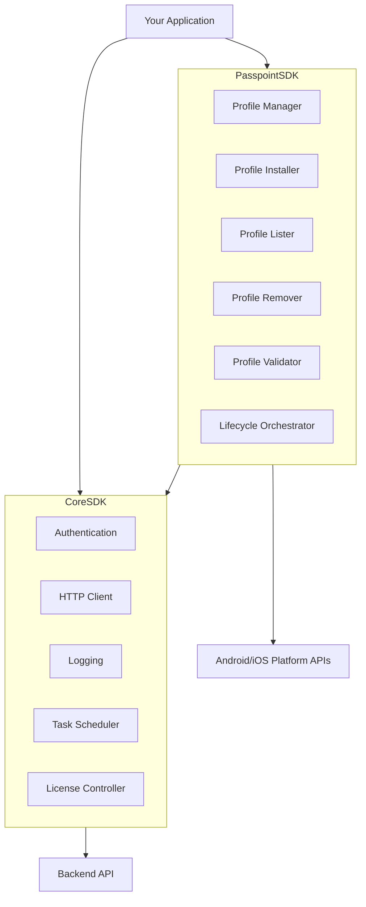

## Overview

The Uplink Passpoint SDK provides a comprehensive solution for managing Passpoint (Hotspot 2.0) Wi-Fi profiles on Android and iOS platforms. This SDK enables developers to programmatically install, manage, and maintain Passpoint profiles, with automatic lifecycle management including certificate monitoring, renewal scheduling, and profile updates.

## Platform Support

- **Android**: API level 24 (Android 7.0 Nougat) or higher
- **iOS**: iOS 13.0 or higher

## Key Features

- **Profile Management**: Install, list, validate, and remove Passpoint profiles
- **Automatic Lifecycle Management**: Certificate monitoring, renewal scheduling, and profile updates
- **Background Operations**: Polling for profile updates, background certificate checks
- **Secure Storage**: Encrypted storage for profile data and credentials
- **Error Handling**: Comprehensive error handling with retry logic and exponential backoff
- **Permission Management**: Automatic permission/entitlement validation and handling
- **Push Notification Support**: Integration with push notification services for profile updates

## Documentation Structure

### Getting Started

- [Android Getting Started Guide](android/getting-started.md) - Quick start for Android integration
- [iOS Getting Started Guide](ios/getting-started.md) - Quick start for iOS integration

### Core SDK Documentation

- [Android Core SDK](android/core-sdk.md) - Core SDK API reference for Android
- [iOS Core SDK](ios/core-sdk.md) - Core SDK API reference for iOS

### Passpoint SDK Documentation

- [Android Passpoint SDK](android/passpoint-sdk.md) - Passpoint SDK API reference for Android
- [iOS Passpoint SDK](ios/passpoint-sdk.md) - Passpoint SDK API reference for iOS

### API Reference

- [API Endpoints](api-endpoints.md) - Backend API endpoints documentation

### Permissions and Entitlements

- [Android Permissions](android/permissions.md) - Required permissions and runtime handling
- [iOS Entitlements](ios/entitlements.md) - Required entitlements and configuration

### Advanced Topics

- [Lifecycle Management](lifecycle-management.md) - Profile polling, certificate monitoring, and renewal
- [Error Handling](error-handling.md) - Error types, codes, and handling strategies
- [Storage and Caching](storage-and-caching.md) - Encrypted storage and cache management

### Code Examples

- [Android Examples](android/examples.md) - Complete code examples for Android
- [iOS Examples](ios/examples.md) - Complete code examples for iOS

### Guides

- [Troubleshooting](troubleshooting.md) - Common issues and solutions
- [Best Practices](best-practices.md) - Recommended implementation patterns

## Quick Start

### Android

```kotlin
// Initialize Core SDK
val coreClient = UplinkCoreClient.fromService(
    baseUrl = "https://api-gateway.develop.uplink.xyz/v2",
    appId = "your-app-id",
    appSecret = "your-app-secret",
    deviceInfo = DeviceInfo(...),
    context = applicationContext
)

// Initialize Passpoint SDK
val passpointClient = UplinkPasspointClient.create(
    context = applicationContext,
    coreClient = coreClient
)

// Install a profile
val result = passpointClient.profileManager().installProfileFromResponse(profileResponse)
```

### iOS

```swift
// Initialize Core SDK
let coreClient = await UplinkCoreClient.create(
    baseURL: "https://api-gateway.develop.uplink.xyz/v2",
    appId: "your-app-id",
    appSecret: "your-app-secret",
    deviceInfo: DeviceInfo(...)
)

// Initialize Passpoint SDK
let passpointClient = UplinkPasspointClient(
    coreClient: coreClient
)

// Install a profile
let result = try await passpointClient.getProfileManager().installProfileFromResponse(profileResponse)
```

## Architecture Overview

The SDK is organized into two main components:

1. **Core SDK**: Provides authentication, HTTP client, logging, task scheduling, and license management
2. **Passpoint SDK**: Provides Passpoint profile management, lifecycle orchestration, and platform-specific implementations


```mermaid
graph TB
    App[Your Application] --> CoreSDK[Uplink Core SDK]
    App --> PasspointSDK[Uplink Passpoint SDK]
    PasspointSDK --> CoreSDK
    CoreSDK --> API[Backend API]
    PasspointSDK --> Platform[Android/iOS Platform APIs]
    
    subgraph CoreSDK
        Auth[Authentication]
        HTTP[HTTP Client]
        Logger[Logging]
        Scheduler[Task Scheduler]
        License[License Controller]
    end
    
    subgraph PasspointSDK
        Manager[Profile Manager]
        Installer[Profile Installer]
        Lister[Profile Lister]
        Remover[Profile Remover]
        Validator[Profile Validator]
        Lifecycle[Lifecycle Orchestrator]
    end
```

## Authentication

The SDK uses JWT-based authentication. Developers must provide `appId` and `appSecret` credentials to authenticate with the backend API. The SDK automatically:

- Authenticates on initialization
- Stores credentials securely
- Refreshes tokens when expired
- Manages subscriber creation

## Lifecycle Management

The SDK provides automatic lifecycle management:

- **Profile Polling**: Checks for profile updates at least once daily
- **Certificate Monitoring**: Monitors certificate expiration dates
- **Renewal Scheduling**: Automatically renews profiles 90 days before expiration
- **Installation Retry**: Retries failed installations with exponential backoff

## Security

- Credentials are stored in encrypted storage
- Profile data is encrypted at rest
- All API communications use HTTPS
- JWT tokens are securely managed and refreshed

## Support

For issues, questions, or contributions, please refer to the troubleshooting guide or contact the SDK support team.

## License

UPLINK ALL RIGHTS RESERVED
