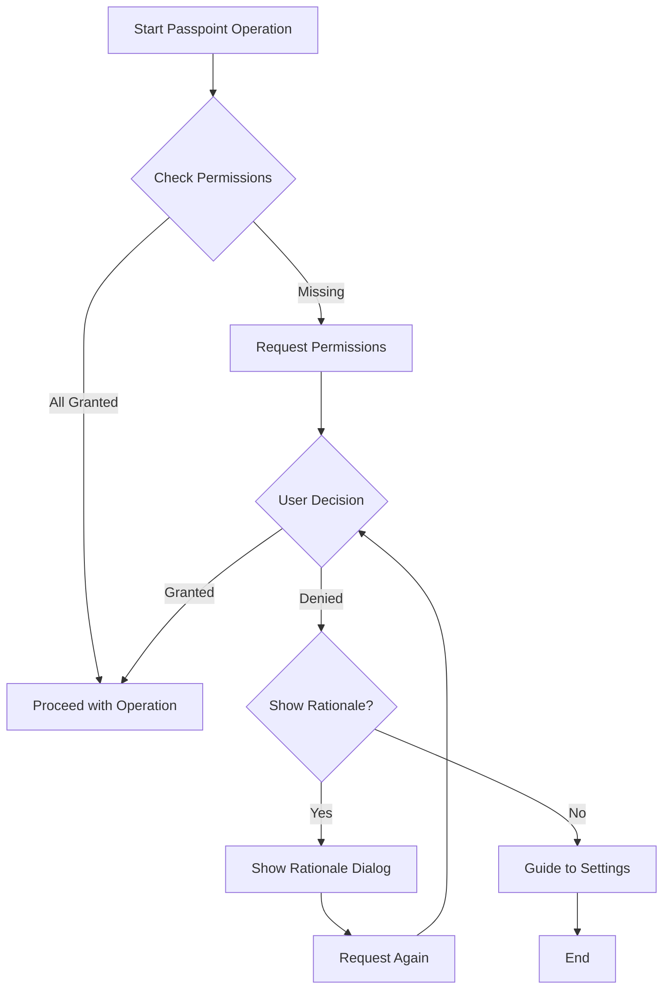

## Overview

The Android Passpoint SDK requires specific permissions to function correctly. This guide covers all required permissions, runtime permission handling, and best practices.

## Required Permissions

The SDK requires the following permissions:

### Manifest Permissions

These permissions are declared in `AndroidManifest.xml` and are granted at install time:

- `INTERNET`: Required for API communication
- `ACCESS_WIFI_STATE`: Required to read Wi-Fi state and list Passpoint profiles
- `CHANGE_WIFI_STATE`: Required to install and remove Passpoint profiles

### Runtime Permissions

These permissions require user approval at runtime (Android 6.0+):

- `ACCESS_FINE_LOCATION`: Required for Passpoint operations on Android 6.0 and higher

## AndroidManifest.xml Configuration

Add the following permissions to your `AndroidManifest.xml`:

```xml
<manifest xmlns:android="http://schemas.android.com/apk/res/android">
    
    <!-- Required permissions -->
    <uses-permission android:name="android.permission.INTERNET" />
    <uses-permission android:name="android.permission.ACCESS_WIFI_STATE" />
    <uses-permission android:name="android.permission.CHANGE_WIFI_STATE" />
    <uses-permission android:name="android.permission.ACCESS_FINE_LOCATION" />
    
</manifest>
```

## Runtime Permission Handling

### Checking Permissions

The SDK provides methods to check and request permissions:

```kotlin
val profileManager = passpointClient.profileManager()

// Check if all permissions are granted
if (profileManager.hasAllPermissions()) {
    // Proceed with Passpoint operations
} else {
    // Request missing permissions
    profileManager.requestPermissions(this) { result ->
        if (result.allGranted) {
            // Permissions granted, proceed
        } else {
            // Handle permission denial
        }
    }
}
```

### Requesting Permissions

```kotlin
profileManager.requestPermissions(activity) { result ->
    when {
        result.allGranted -> {
            // All permissions granted
            proceedWithPasspointOperations()
        }
        result.shouldShowRationale -> {
            // Show rationale to user
            showPermissionRationale()
        }
        else -> {
            // Permissions denied, guide user to settings
            showPermissionSettingsDialog()
        }
    }
}
```

### Handling Permission Results

Handle permission results in your Activity:

```kotlin
override fun onRequestPermissionsResult(
    requestCode: Int,
    permissions: Array<out String>,
    grantResults: IntArray
) {
    super.onRequestPermissionsResult(requestCode, permissions, grantResults)
    
    profileManager.handlePermissionResult(requestCode, permissions, grantResults)?.let { result ->
        if (result.allGranted) {
            // Permissions granted
            proceedWithPasspointOperations()
        } else {
            // Handle denied permissions
            handlePermissionDenial(result.missingPermissions)
        }
    }
}
```

### Permission Status

Get detailed permission status:

```kotlin
val permissionStatus = profileManager.checkPermissions()

if (permissionStatus.allGranted) {
    // All permissions granted
} else {
    // Show missing permissions
    val missing = permissionStatus.missingPermissions
    Log.w("App", "Missing permissions: ${missing.joinToString()}")
    
    // Show user-friendly message
    showMessage(permissionStatus.userFriendlyMessage)
}
```

## Permission Request Flow


```mermaid
flowchart TD
    Start[Start Passpoint Operation] --> Check{Check Permissions}
    Check -->|All Granted| Proceed[Proceed with Operation]
    Check -->|Missing| Request[Request Permissions]
    Request --> UserDecision{User Decision}
    UserDecision -->|Granted| Proceed
    UserDecision -->|Denied| ShowRationale{Show Rationale?}
    ShowRationale -->|Yes| ShowRationaleDialog[Show Rationale Dialog]
    ShowRationaleDialog --> RequestAgain[Request Again]
    RequestAgain --> UserDecision
    ShowRationale -->|No| Settings[Guide to Settings]
    Settings --> End[End]
```

## Best Practices

1. **Check Before Operations**: Always check permissions before performing Passpoint operations
2. **Request at Appropriate Time**: Request permissions when the user initiates a Passpoint operation
3. **Explain Why**: Show a rationale explaining why location permission is needed
4. **Handle Denial Gracefully**: Provide clear guidance when permissions are denied
5. **Respect User Choice**: Don't repeatedly request permissions if the user has denied them

## Permission Rationale Example

```kotlin
private fun showPermissionRationale() {
    AlertDialog.Builder(this)
        .setTitle("Location Permission Required")
        .setMessage("Location permission is required for Passpoint Wi-Fi operations. This is an Android system requirement for Wi-Fi configuration.")
        .setPositiveButton("Grant") { _, _ ->
            profileManager.requestPermissions(this) { result ->
                if (result.allGranted) {
                    proceedWithPasspointOperations()
                }
            }
        }
        .setNegativeButton("Cancel", null)
        .show()
}
```

## Common Issues

### Permission Denied

**Issue**: Permission is denied by user

**Solution**: 
- Show rationale explaining why permission is needed
- Guide user to app settings if permission is permanently denied
- Handle gracefully and don't block app functionality

### Permission Not Requested

**Issue**: Permission check passes but operation fails

**Solution**:
- Ensure you're checking permissions on the correct Android version
- Verify permission is declared in manifest
- Check if permission is granted at runtime

## Related Documentation

- [Passpoint SDK API Reference](passpoint-sdk.md)
- [Getting Started Guide](getting-started.md)
- [Code Examples](examples.md)
