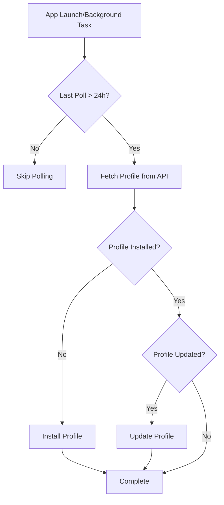
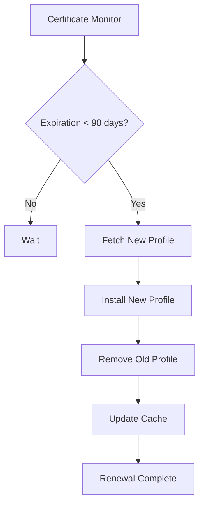

## Overview

The Passpoint SDK provides automatic lifecycle management for Passpoint profiles, including profile polling, certificate monitoring, renewal scheduling, and installation retry logic.

## Profile Polling

Profile polling checks for profile updates from the backend API at least once daily.

### Polling Mechanism

- **Interval**: Polls at least once every 24 hours
- **Trigger**: Automatic on app launch or background refresh
- **Manual Trigger**: Can be manually triggered via `checkForProfileUpdates()`

### Android Implementation

Uses WorkManager for background polling:

```kotlin
// Polling is automatically started when PasspointClient is created
val passpointClient = UplinkPasspointClient.create(...)

// Manually trigger polling
passpointClient.checkForProfileUpdates()

// Check if polling should be triggered
if (passpointClient.shouldPollForUpdates()) {
    passpointClient.checkForProfileUpdates()
}
```

### iOS Implementation

Uses BGTaskScheduler for background polling:

```swift
// Register background task in AppDelegate
PasspointProfilePoller.registerBackgroundTask()

// Polling is automatically started when PasspointClient is created
let passpointClient = UplinkPasspointClient(...)

// Manually trigger polling
try await passpointClient.checkForProfileUpdates()

// Check if polling should be triggered
if passpointClient.shouldPollForUpdates() {
    try await passpointClient.checkForProfileUpdates()
}
```

### Polling Flow


```mermaid
flowchart TD
    Start[App Launch/Background Task] --> Check{Last Poll > 24h?}
    Check -->|No| Skip[Skip Polling]
    Check -->|Yes| Fetch[Fetch Profile from API]
    Fetch --> CheckInstalled{Profile Installed?}
    CheckInstalled -->|No| Install[Install Profile]
    CheckInstalled -->|Yes| CheckUpdate{Profile Updated?}
    CheckUpdate -->|Yes| Update[Update Profile]
    CheckUpdate -->|No| Done[Complete]
    Install --> Done
    Update --> Done
```

## Certificate Monitoring

Certificate monitoring tracks certificate expiration dates and triggers renewal when needed.

### Monitoring Mechanism

- **Frequency**: Checks certificates periodically (default: every 24 hours)
- **Renewal Trigger**: 90 days before certificate expiration
- **Status Tracking**: Tracks profile status (ACTIVE, EXPIRED, PENDING_RENEWAL)

### Manual Monitoring

```kotlin
// Android
passpointClient.checkCertificateMonitoring()
```

```swift
// iOS
try await passpointClient.checkCertificateMonitoring()
```

### Certificate Status

- **ACTIVE**: Certificate is valid and not expired
- **EXPIRED**: Certificate has expired
- **PENDING_RENEWAL**: Certificate is within renewal window (90 days before expiration)

## Renewal Scheduling

Renewal scheduling automatically renews profiles 90 days before certificate expiration.

### Renewal Process

1. Certificate monitor detects profile needs renewal
2. Renewal scheduler fetches new profile from API
3. New profile is installed
4. Old profile is removed (if possible)
5. Cache is updated

### Manual Renewal

```kotlin
// Android
passpointClient.checkRenewal()
```

```swift
// iOS
try await passpointClient.checkRenewal()
```

### Renewal Flow


```mermaid
flowchart TD
    Monitor[Certificate Monitor] --> Check{Expiration < 90 days?}
    Check -->|No| Wait[Wait]
    Check -->|Yes| Fetch[Fetch New Profile]
    Fetch --> Install[Install New Profile]
    Install --> Remove[Remove Old Profile]
    Remove --> Update[Update Cache]
    Update --> Complete[Renewal Complete]
```

## Installation Retry Logic

The SDK automatically retries failed installations with exponential backoff.

### Retryable Errors

- Network errors
- Transient system errors
- Timeouts
- API status errors (5xx)

### Non-Retryable Errors

- Permission errors
- Configuration errors (invalid profile)
- Unsupported operations
- Missing required fields

### Retry Strategy

- **Initial Delay**: 1 second
- **Max Delay**: 60 seconds
- **Backoff**: Exponential (2x)
- **Max Attempts**: 5 attempts

### Error Callback

Implement `PasspointErrorCallback` to receive retry notifications:

```kotlin
// Android
val errorCallback = object : PasspointErrorCallback {
    override fun onInstallationError(error: Throwable, attempt: Int, willRetry: Boolean) {
        Log.e("App", "Installation error (attempt $attempt, willRetry: $willRetry): ${error.message}")
    }
}
```

```swift
// iOS
class MyErrorCallback: PasspointErrorCallback {
    func onInstallationError(error: Error, attempt: Int, willRetry: Bool) {
        print("Installation error (attempt \(attempt), willRetry: \(willRetry)): \(error.localizedDescription)")
    }
}
```

## Push Notification Integration

The SDK supports push notification integration for immediate profile updates.

### Notification Handler

```kotlin
// Android
val notificationHandler = passpointClient.getNotificationHandler()
// Handle push notification payload
notificationHandler?.handleProfileUpdateNotification(payload)
```

```swift
// iOS
let notificationHandler = passpointClient.getNotificationHandler()
// Handle push notification payload
notificationHandler.handleProfileUpdateNotification(payload: payload)
```

### Notification Payload

```json
{
  "type": "profile_update",
  "profileId": "profile-123",
  "action": "install" | "update" | "remove"
}
```

## Lifecycle Orchestrator

The `PasspointLifecycleOrchestrator` coordinates all lifecycle services:

- Profile Polling
- Certificate Monitoring
- Renewal Scheduling
- Installation Retry

The orchestrator is automatically started when `UplinkPasspointClient` is created.

### Stopping Lifecycle Services

```kotlin
// Android
passpointClient.stop()
```

```swift
// iOS
passpointClient.stop()
```

## Best Practices

1. **Let SDK Manage Lifecycle**: Don't manually manage polling/renewal unless necessary
2. **Handle Errors**: Implement error callbacks for retry notifications
3. **Monitor Status**: Check profile status periodically
4. **Push Notifications**: Use push notifications for immediate updates when available
5. **Background Tasks**: Ensure background tasks are properly configured (iOS)

## Related Documentation

- [Error Handling](error-handling.md)
- [Storage and Caching](storage-and-caching.md)
- [Best Practices](best-practices.md)
