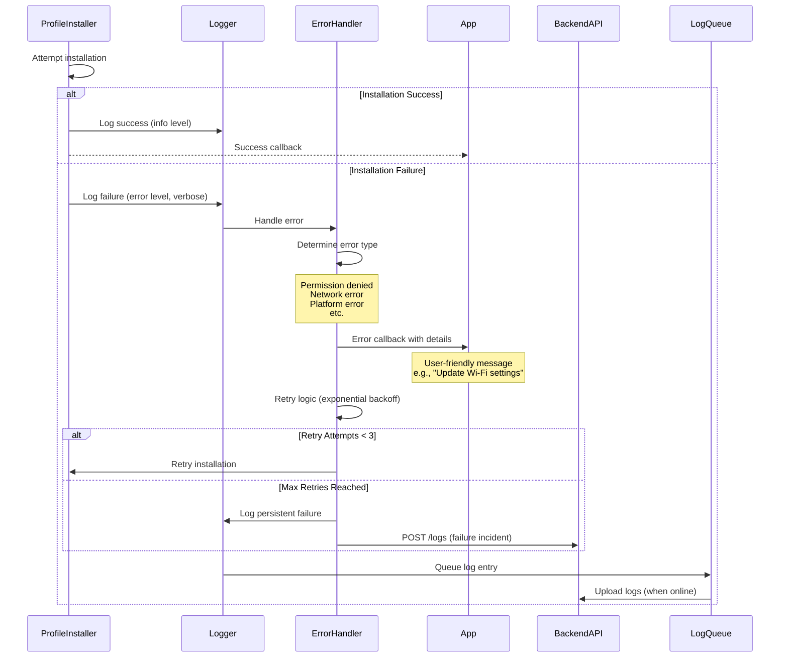
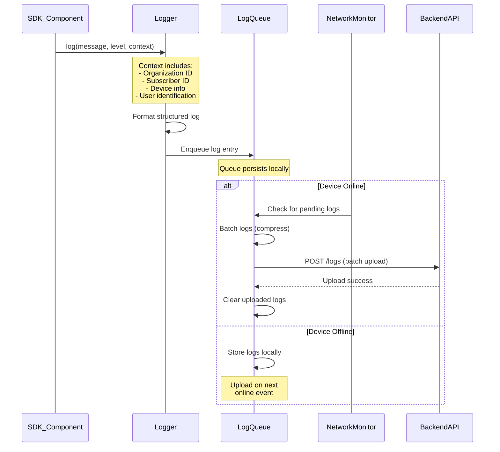
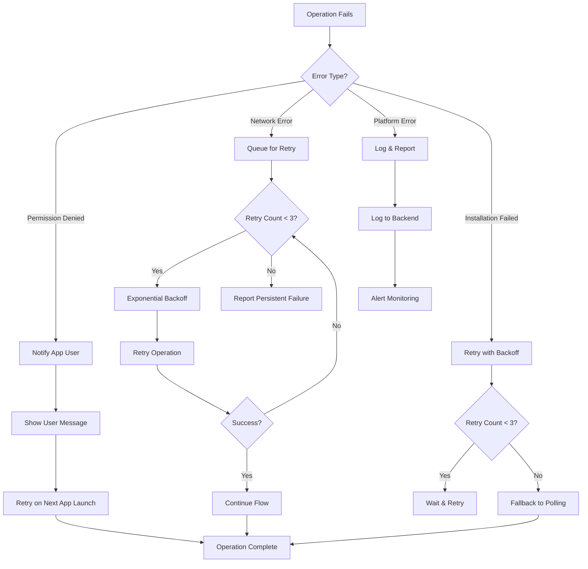

# Error Handling & Logging Flow

## Error Handling Flow

```mermaid
sequenceDiagram
    participant ProfileInstaller
    participant Logger
    participant ErrorHandler
    participant App
    participant BackendAPI
    participant LogQueue
    
    ProfileInstaller->>ProfileInstaller: Attempt installation
    
    alt Installation Success
        ProfileInstaller->>Logger: Log success (info level)
        ProfileInstaller-->>App: Success callback
    else Installation Failure
        ProfileInstaller->>Logger: Log failure (error level, verbose)
        Logger->>ErrorHandler: Handle error
        
        ErrorHandler->>ErrorHandler: Determine error type
        Note over ErrorHandler: Permission denied<br/>Network error<br/>Platform error<br/>etc.
        
        ErrorHandler->>App: Error callback with details
        Note over App: User-friendly message<br/>e.g., "Update Wi-Fi settings"
        
        ErrorHandler->>ErrorHandler: Retry logic (exponential backoff)
        alt Retry Attempts < 3
            ErrorHandler->>ProfileInstaller: Retry installation
        else Max Retries Reached
            ErrorHandler->>Logger: Log persistent failure
            ErrorHandler->>BackendAPI: POST /logs (failure incident)
        end
        
        Logger->>LogQueue: Queue log entry
        LogQueue->>BackendAPI: Upload logs (when online)
    end
```

## Logging & Upload Flow

```mermaid
sequenceDiagram
    participant SDK_Component
    participant Logger
    participant LogQueue
    participant NetworkMonitor
    participant BackendAPI
    
    SDK_Component->>Logger: log(message, level, context)
    Note over Logger: Context includes:<br/>- Organization ID<br/>- Subscriber ID<br/>- Device info<br/>- User identification
    
    Logger->>Logger: Format structured log
    Logger->>LogQueue: Enqueue log entry
    
    Note over LogQueue: Queue persists locally
    
    alt Device Online
        NetworkMonitor->>LogQueue: Check for pending logs
        LogQueue->>LogQueue: Batch logs (compress)
        LogQueue->>BackendAPI: POST /logs (batch upload)
        BackendAPI-->>LogQueue: Upload success
        LogQueue->>LogQueue: Clear uploaded logs
    else Device Offline
        LogQueue->>LogQueue: Store logs locally
        Note over LogQueue: Upload on next<br/>online event
    end
```

## Error Recovery Flow

```mermaid
graph TD
    A[Operation Fails] --> B{Error Type?}
    B -->|Permission Denied| C[Notify App User]
    B -->|Network Error| D[Queue for Retry]
    B -->|Platform Error| E[Log & Report]
    B -->|Installation Failed| F[Retry with Backoff]
    
    C --> G[Show User Message]
    G --> H[Retry on Next App Launch]
    
    D --> I{Retry Count < 3?}
    I -->|Yes| J[Exponential Backoff]
    J --> K[Retry Operation]
    K --> L{Success?}
    L -->|Yes| M[Continue Flow]
    L -->|No| I
    I -->|No| N[Report Persistent Failure]
    
    E --> O[Log to Backend]
    O --> P[Alert Monitoring]
    
    F --> Q{Retry Count < 3?}
    Q -->|Yes| R[Wait & Retry]
    Q -->|No| S[Fallback to Polling]
    
    H --> T[Operation Complete]
    M --> T
    S --> T
```

